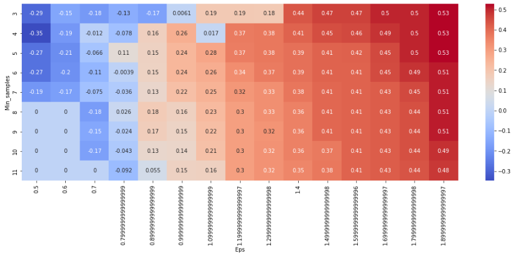

# Clustering Analysis for Humanitarian Aid Allocation

In this data science project, we aim to assist HELP International, an international humanitarian NGO, in strategically allocating $10 million to countries in dire need of aid. We will use unsupervised learning techniques to categorize countries based on socio-economic and health factors that determine their overall development. The goal is to provide the CEO of HELP International with a clear recommendation on which countries to prioritize for aid.

## Table of Contents

- [Introduction](#intro)
- [Data Exploration](#eda)
- [Distribution Analysis](#pre)
- [Data Scaling](#scal)
- [Principal Component Analysis (PCA)](#pca)
- [K-Means Clustering with PCA](#kmeans)
- [K-Means Clustering without PCA](#kmeans_no)
- [Agglomerative Hierarchical Clustering with PCA](#hc)
- [Agglomerative Hierarchical Clustering without PCA](#hc_no)
- [DBSCAN Clustering with PCA](#db)
- [DBSCAN Clustering without PCA](#db_no)
- [Results Evaluation](#r)

## [Introduction](#intro)

HELP International is dedicated to combating poverty and providing essential support during natural disasters in underprivileged countries. With the organization raising $10 million, it is crucial to identify countries where this financial support will have the most significant impact. This project employs data science and machine learning to determine which countries require immediate assistance based on specific indicators.

## [Data Exploration](#eda)

First, we load the necessary libraries for the project. In this particular project I'm trying to compare 3 ways of clustering: K-means, Hierarchical Clustering and DBSCAN. Also I include the usage of PCA for dimensionality reduction.

We also explore a little bit our DataFrame to confirm that everything is in it's place and ready to start modeling.

```python
import pandas as pd
import numpy as np
import seaborn as sns
import matplotlib.pyplot as plt

from itertools import product
from sklearn.preprocessing import StandardScaler
from sklearn.decomposition import PCA
from sklearn.cluster import KMeans, AgglomerativeClustering, DBSCAN
from sklearn.neighbors import NearestNeighbors
from sklearn.metrics import silhouette_score
from scipy.cluster.hierarchy import dendrogram, linkage

path = r'..\Country-data.csv'
df = pd.read_csv(path)

df.describe()
df.head(5)
df.info()
print(df.shape)
print(df.dtypes)
df.isnull().sum()
```

## [Distribution Analysis](#pre)

Here we are going to plot the distribution of each feautre in the dataset using boxplots.

```python
int_cols = df.select_dtypes(exclude='object').columns

for i in int_cols:
    plt.figure(figsize=(5, 5))
    sns.boxplot(data=df, y=i)
    plt.show()

fig = plt.figure(figsize=(15, 10))
sns.heatmap(df.drop('country', axis=1).corr(), annot=True, cmap='coolwarm')
plt.show()
```


## [Data Scaling](#scal)

We scale our data using ```StandardScaler()```

```python
scaler = StandardScaler()
df_scaled = scaler.fit_transform(df.drop('country', axis=1))

df_scaled = pd.DataFrame(df_scaled, columns=df.drop('country', axis=1).columns)

df_scaled.head(5)
```

## [Principal Component Analysis (PCA)](#pca)

We apply the popular Dimensionality Reduction method: Principal Component Analysis. This method is used to see which components of our dataset contains the most variance and use those components as new data. What we are doing is transform our data to reduce it's dimensionality.

```python
pca = PCA()
pca.fit(df.drop('country', axis=1))
pca_scaled = pca.transform(df_scaled)

print(pca_scaled)

var = pca.explained_variance_ratio_
print(var)

plt.figure(figsize=(8, 4))
plt.plot(range(1, len(var) + 1), var, marker='o', linestyle='-')
plt.xlabel('Principal Component')
plt.ylabel('Explained Variance Ratio')
plt.title('Scree Plot')
plt.grid(True)
plt.show()
```


```python
cum_var = np.cumsum(np.round(var, decimals=4) * 100)
plt.figure(figsize=(8, 8))
plt.plot(cum_var, 'r-x')
plt.show()
```


```python
pca_standard = pd.DataFrame(pca_scaled)
pca_standard.drop([4, 5, 6, 7, 8], axis=1, inplace=True)
pca_standard.head(5)
```

## [K-Means Clustering with PCA](#kmeans)

We begin testing K-Means clustering. We loop through an arbitrary (not so much) range of clusters to see the model's performance with each one. For testing we are using the silhouette score and the inertia.

In this initial step we use the PCA DataFrame.

```python
sum_of_squared_distances = []
silhouette_scores = []
K = range(2, 15)
for _ in K:
    km = KMeans(n_clusters=_)
    y = km.fit_predict(pca_standard)
    sum_of_squared_distances.append(km.inertia_)
    silhouette_scores.append(silhouette_score(pca_standard, y))

plt.figure(figsize=(6, 6))
plt.plot(K, sum_of_squared_distances, 'bx-')
plt.xlabel('K')
plt.ylabel('Inertia')
plt.show()
```


```python
plt.figure(figsize=(6, 6))
plt.plot(silhouette_scores, 'rx-')
plt.xlabel('K')
plt.ylabel('Silhouette Score')
plt.show()
```


```python
km = KMeans(n_clusters=4)
y = km.fit_predict(pca_standard)
print(silhouette_score(pca_standard, y))
df['k_means_pca'] = y
```

## [K-Means Clustering without PCA](#kmeans_no)

We repeat the exact same process as before but this time without using the scaled_pca DataFrame.

```python
sum_of_squared_distances = []
silhouette_scores = []
K = range(2, 15)
for _ in K:
    km = KMeans(n_clusters=_)
    y = km.predict(df_scaled)
    sum_of_squared_distances.append(km.inertia_)
    silhouette_scores.append(silhouette_score(df_scaled, y))

plt.figure(figsize=(6, 6))
plt.plot(K, sum_of_squared_distances, 'bx-')
plt.xlabel('K')
plt.ylabel('Inertia')
plt.show()
```


```python
plt.figure(figsize=(6, 6))
plt.plot(K, silhouette_scores, 'rx-')
plt.xlabel('K')
plt.ylabel('Silhouette Score')
plt.show()
```


```python
km = KMeans(n_clusters=5)
y = km.fit_predict(df_scaled)
print(silhouette_score(df_scaled, y))
df['k_means'] = y
```

## [Agglomerative Hierarchical Clustering using PCA](#hc)

Now we implement the Agglomerative Hierarchical Clustering with the PCA DataFrame to see its performance. First we display the Dendrogram Plot to see the distribution of clusters and give us an idea of where to begin clustering.

```python
plt.figure(figsize=(8, 8))
dendrogram_plot_pca = dendrogram(linkage(pca_standard.values, method='ward'))
plt.title('Country Dendrogram')
plt.xlabel('Clusters')
plt.ylabel('Euclidean Distance')
plt.show()
```


```python
hc_pca = AgglomerativeClustering(n_clusters=2, affinity='euclidean', linkage='ward')
y_hc_pca = hc_pca.fit_predict(pca_standard)
df['hc_pca'] = y_hc_pca
```

## [Agglomerative Hierarchical Clustering without PCA](#hc_no)

We repeat the same process but this time without the PCA DataFrame but with the scaled one.

```python
plt.figure(figsize=(8, 8))
dendrogram_plot = dendrogram(linkage(df_scaled.values, method='ward'))
plt.title('Country Dendrogram')
plt.xlabel('Clusters')
plt.ylabel('Euclidean Distance')
plt.show()
```


```python
hc = AgglomerativeClustering(n_clusters=3, affinity='euclidean', linkage='ward')
y_hc = hc.fit_predict(df_scaled)
print(silhouette_score(df_scaled, y_hc))
df['hc'] = y_hc
```

## [DBSCAN Clustering with PCA](#db)

Finally we perform a DBCSAN methodology.

```python
neighbors = NearestNeighbors(n_neighbors=2)
neighbors_fit = neighbors.fit(pca_standard)
distances, indices = neighbors_fit.kneighbors(pca_standard)

distances = np.sort(distances, axis=0)
distances = distances[:, 1]
plt.figure(figsize=(6, 6))
plt.plot(distances)
plt.show()
```


```python
eps_values = np.arange(0.5, 2.0, 0.10)
min_samples = np.arange(3, 12)

dbscan_params = list(product(eps_values, min_samples))
n_of_clusters = []
sil_score = []

for p in dbscan_params:
    y_dbscan = DBSCAN(eps=p[0], min_samples=p[1]).fit_predict(pca_standard)
    try:
        sil_score.append(silhouette_score(pca_standard, y_dbscan))
    except:
        sil_score.append(0)
    n_of_clusters.append(len(np.unique(y_dbscan)))

df_param_tuning = pd.DataFrame.from_records(dbscan_params, columns=['Eps', 'Min_samples'])
df_param_tuning['sil_score'] = sil_score
df_param_tuning['n_clusters'] = n_of_clusters

pivot_1 = pd.pivot_table(df_param_tuning, values='sil_score', columns='Eps', index='Min_samples')
pivot_2 = pd.pivot_table(df_param_tuning, values='n_clusters', columns='Eps', index='Min_samples')

fig_1, ax = plt.subplots(figsize=(18, 6))
sns.heatmap(pivot_1, annot=True, annot_kws={'size': 10}, cmap='coolwarm', ax=ax)
plt.show()
```



```python
fig_2, ax = plt.subplots(figsize=(18, 6))
sns.heatmap(pivot_2, annot=True, annot_kws={'size': 10}, cmap='coolwarm', ax=ax)
plt.show()

dbscan_train = DBSCAN(eps=1.2, min_samples=3)
y_dbscan = dbscan_train.fit_predict(pca_standard)
print(silhouette_score(pca_standard, y_dbscan))
df['dbscan_pca'] = y_dbscan
```


## [DBSCAN Clustering without PCA](#db_no)

Same process as before but without PCA.

```python
neighbors = NearestNeighbors(n_neighbors=2)
neighbors_fit = neighbors.fit(df_scaled)
distances, indices = neighbors_fit.kneighbors(df_scaled)

distances = np.sort(distances, axis=0)
distances = distances[:, 1]

plt.figure(figsize=(6, 6))
plt.plot(distances)
plt.show()
```


```python
eps_values = np.arange(1, 3.0, 0.1)
min_samples = np.arange(3, 12)

dbscan_params = list(product(eps_values, min_samples))
n_of_clusters = []
sil_score = []

for p in dbscan_params:
    y_dbscan = DBSCAN(eps=p[0], min_samples=p[1]).fit_predict(df_scaled)
    try:
        sil_score.append(silhouette_score(df_scaled, y_dbscan))
    except:
        sil_score.append(0)
    n_of_clusters.append(len(np.unique(y_dbscan)))

df_param_tuning = pd.DataFrame.from_records(dbscan_params, columns=['Eps', 'Min_samples'])
df_param_tuning['sil_score'] = sil_score
df_param_tuning['n_clusters'] = n_of_clusters

pivot_1 = pd.pivot_table(df_param_tuning, values='sil_score', columns='Eps', index='Min_samples')
pivot_2 = pd.pivot_table(df_param_tuning, values='n_clusters', columns='Eps', index='Min_samples')

fig_3, ax = plt.subplots(figsize=(18, 6))
sns.heatmap(pivot_1, annot=True, annot_kws={'size': 10}, cmap='coolwarm', ax=ax)
plt.show()
```


```python
fig_4, ax = plt.subplots(figsize=(18, 6))
sns.heatmap(pivot_2, annot=True, annot_kws={'size': 10}, cmap='coolwarm', ax=ax)
plt.show()

dbscan_train = DBSCAN(eps=1.7, min_samples=3)
y_dbscan = dbscan_train.fit_predict(df_scaled)
print(silhouette_score(df_scaled, y_dbscan))
df['dbscan'] = y_dbscan
```


## [Results Evaluation](#r)

Here we plot the distribution of each feature with the clusters on the label using K-Means with PCA (better result).

```python
results = df[
    ['child_mort',
     'exports',
     'health',
     'imports',
     'income',
     'inflation',
     'life_expec',
     'total_fer',
     'gdpp',
     'k_means_pca']
]

sns.pairplot(data=results[
    ['child_mort',
     'exports',
     'health',
     'imports',
     'income',
     'inflation',
     'life_expec',
     'total_fer',
     'gdpp',
     'k_means_pca']],
             hue='kmeans_pca',
             palette='coolwarm'
             )

plt.figure(figsize=(8, 8))
sns.scatterplot(data=df, x='child_mort', y='gdpp', hue='kmeans_pca', palette='coolwarm')
plt.show()
```


